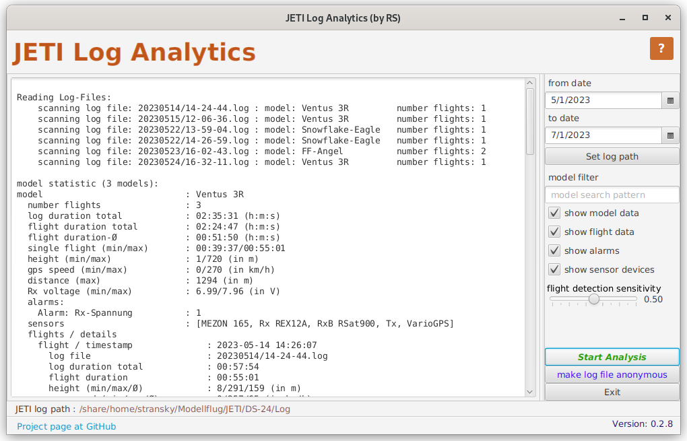

#  JETI Log Analytics  
a standalone application to parse and analyses JETI log files in a bulk matter.
The current version of JETI Log Analytics can be used in a command line mode or in a GUI based mode.
JETI Log Analytics is a Java application (using JavaFX as GUI framework) build as a runnable jar file.
The required JRE is at least a Java-8. Open-JDK should work.
On Windows and Mac this JetiLogAnalytics.jar - file can be easily started by double clicking the file. On Linux the wrapper script JetiLogAnalytics.sh can be used to start teh GUI based application.

The application is written to extract detailed data per flight, per model and total. One of the main features is a flight detection algorithm (based on the signal levels A1 and A2 given by any RX of JETI), which does provides extraction of detailed data only if the model is not in the near area of the transmitter (air field, workbench, ...).

JET Log Analytics needs only a base directory as argument to find the JETI log files in their date based folder structure. It scans all files and gives information about files, models, flights and overall data.
It is possible to give a date range to filter the given information to the need range.

So it is very easy to get the overall pure flight duration for the given files. In addition to the flight duration it will give some statistical data (if existing) per flight/model:
* modelname
* real flight duration
* log duration
* real number of flight (not count of log files)
* flight heights
* flight speeds (air- and GPS-speed)
* flight distance
* RX voltage minimum 
* list of alarms and number
* timestamps with the real start of flight
* signal-pulse-distance (in case the an RXQ sensor is available)

 Here an short example of a scan result:
	
	Reading Log-Files:
	  scanning log file: 20200301/14-05-54.log : model: X-Swift 3.2, number flights: 1
	  scanning log file: 20200303/12-06-22.log : model: X-Swift 3.2, number flights: 0
	  scanning log file: 20200303/15-24-31.log : model: X-Swift 3.2, number flights: 1
	
	model statistic (1 models):
	model                           : X-Swift 3.2
	  number flights                : 2
	  flight duration total         : 01:28:24
	  log duration total            : 01:49:47
	  height (min/max)              : 0/270 (in m)
	  gps speed (min/max)           : 0/233 (in km/h)
	  signal-pulse-distance (max)   : 53 (in ms)
	  distance (min/max)            : 0/782 (in m)
	  Rx voltage (min)              : 7.1 (in V)
	  alarms:
	    900MHz Tx aktiviert         : 1
	    Alarm: Rx-Spannung          : 13
	    Schw. Signal: Q             : 6
	    Signalverlust               : 3
	  flights / details             
	    flight / timestamp              : 2020-03-01 14:06:52
	      log file                      : 20200301/14-05-54.log
	      log duration total            : 00:36:59
	      flight duration               : 00:35:58
	      height (min/max/Ø)            : 4/270/97 (in m)
	      gps speed (min/max/Ø)         : 0/233/58 (in km/h)
	      signal-pulse-distance (max)   : 9 (in ms)
	      distance (min/max/Ø)          : 0/611/162 (in m)
	      Rx voltage (min)              : 7.1 (in V)
	      alarms:
	        Alarm: Rx-Spannung          : 13
	        Schw. Signal: Q             : 1
	        Signalverlust               : 3
	    flight / timestamp              : 2020-03-03 15:28:30
	      log file                      : 20200303/15-24-31.log
	      log duration total            : 00:57:32
	      flight duration               : 00:52:26
	      height (min/max/Ø)            : 0/216/99 (in m)
	      gps speed (min/max/Ø)         : 0/199/52 (in km/h)
	      signal-pulse-distance (max)   : 53 (in ms)
	      distance (min/max/Ø)          : 4/782/228 (in m)
	      Rx voltage (min)              : 7.37 (in V)
	      alarms:
	        900MHz Tx aktiviert         : 1
	        Schw. Signal: Q             : 5
	
	
	Statisic total                  
	  number logs total             : 3
	  log duration total            : 01:49:47
	  number models                 : 1
	  number flights total          : 2
	  flight duration total         : 01:28:24
	  alarms                        :
	    900MHz Tx aktiviert         : 1
	    Alarm: Rx-Spannung          : 13
	    Schw. Signal: Q             : 6
	    Signalverlust               : 3
	